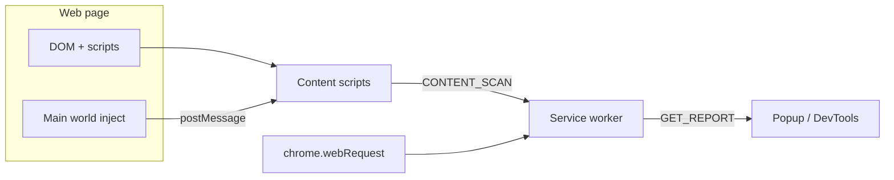

# AI Website Security Inspector

A **Manifest V3** Chrome extension that performs **passive, browser-local** security and technology analysis of the active tab. There are **no paid APIs**, **no cloud backends**, and **no telemetry**—analysis uses DOM inspection, `chrome.webRequest` response headers, a bundled JSON vulnerability baseline, and lightweight main-world hooks for network visibility.

## Architecture (high level)

- **Background service worker** (`src/background/service-worker.ts`): listens to `webRequest` for document response headers (CSP, HSTS, framing, MIME sniffing, referrer, permissions policy, CORS) and `Set-Cookie` lines; buffers XHR/fetch-like requests per tab; merges globals hints from the page; loads `data/vulnerabilities.json`; builds the merged `SecurityReport` and stores it in `chrome.storage.local`.
- **Content scripts**:
  - `content-start` (`document_start`): registers `window.postMessage` listeners and asks the background to inject the main-world probe early.
  - `content` (`document_idle`): collects DOM/meta/scripts/forms/inline script samples and sends `CONTENT_SCAN` to the background.
- **Main-world inject** (`inject-main.ts`): wraps `fetch` and `XMLHttpRequest.prototype.open`, posts API URLs to the isolated world, and snapshots a small set of globals (including jQuery version when present).
- **Analysis modules** (`src/analysis/`): headers, cookies (from `Set-Cookie` + `document.cookie` context), technology heuristics, library version checks vs local JSON, forms, API URL heuristics, inline secret pattern scan (conservative), scoring, and static recommendation templates.
- **UI** (`src/ui/report-view.ts`): shared dashboard for the **popup** and **DevTools panel** (severity filters, tabs, exports, theme toggle).
- **DevTools** (`src/devtools/`): registers the **“Security Inspector”** panel and polls every 2 seconds while open.



## Permissions (minimal by design)

- `activeTab`, `scripting`, `storage`, `tabs`, `webRequest`
- `host_permissions`: `<all_urls>` (required to observe response headers and API traffic for arbitrary sites)

The extension **does not** request `cookies`, `<all_urls>` beyond passive observation, or broad `*://*/*` beyond the single host permission entry (here: all URLs for analysis). Cookie attributes are derived from **`Set-Cookie` response headers** (visible to the extension with `extraHeaders`), not from the `chrome.cookies` API.

## Build

```bash
npm install
npm run check   # TypeScript
npm run build   # outputs to dist/
```

## Load in Chrome (unpacked)

1. Run `npm run build`.
2. Open `chrome://extensions`.
3. Enable **Developer mode**.
4. Click **Load unpacked** and select the `dist/` directory (must contain `manifest.json`).

## Using the product

- **Toolbar popup**: open any `http(s)` page, click the extension icon, then **Rescan** to pull the latest merged report.
- **DevTools**: open Developer Tools → **Security Inspector** panel for live refresh (2s) while debugging.

### Bonus features

- Export report as **JSON** or **HTML** (HTML embeds a pretty-printed JSON snapshot).
- **Copy tips** copies recommendation lines to the clipboard.
- **Theme** toggle (persisted in `chrome.storage.local`).
- **Scan history** (last 12 runs, truncated findings) stored locally under `scanHistory`.

## Security & ethics

- **Passive only**: no exploitation, fuzzing, credential stuffing, or hidden requests beyond what the page already performs.
- **False positives**: inline “secret” detection is regex-based and can flag test keys or minified strings—always verify manually.
- **Limitations**: first-party headers are tied to navigations observed via `webRequest`; SPAs that never trigger a new `main_frame` may show stale header context until reload. Library versions parsed from URLs can be wrong if filenames are non-standard.

## Performance notes

- Inline script digest is capped (~120KB) before secret scanning.
- HTML sample is capped (~220KB) for technology heuristics.
- API URLs are ring-buffered per tab; scan history truncates findings.

## Future enhancements (still offline-friendly)

- Heavier **autocomplete** / **CSRF token** form checks with structured field metadata from the content script.
- Expand **vulnerability JSON** with more libraries and semver ranges.
- Optional **import maps** / **service worker** presence checks.
- **Localization** for beginner explanations.

## License

This repository previously contained unrelated placeholder content; the extension sources are provided as implemented for the MVP described above.
